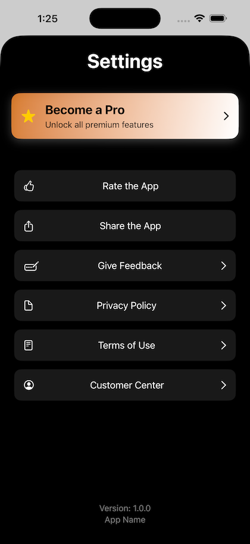

# SettingsKit

A SwiftUI Settings SDK that provides a standardized, professional and simple settings interface for any app. It features a built-in paywall banner, modular settings items, and automatic footer branding.



---

## Features

- **Premium Banner**: Integrated "Become a Pro" banner that automatically hides when isUserSubscribed is true.

- **Actions**: Pre-defined actions for Rating, Sharing, URL opening, and custom Sheet presentations.

- **Auto-Footer**: Displays the App Name and Version automatically at the bottom of the list.

- **Extensible**: Easily add or remove settings items without changing the view layout.
  
- **Optional RevenueCat Customer Center**: Access RevenueCat Customer Center to view subscription and customer information. *Requires RevenueCat SDK*

---

## Installation

Swift Package Manager (SPM)
In Xcode, go to File > Add Packages...

Enter the repository URL: [BKSettingsKit](https://github.com/KocBaturay/BKSettingsKit)

Select Up to Next Major Version and click Add Package.

---

## Usage

```swift
SettingsView(
    config: SettingsConfig(
        appVersion: "1.0.0",
        appName: "App Name",
        isUserSubscribed: isUserSubscribed
    ),
    items: [
        SettingsItem(title: "Rate the App", icon: "hand.thumbsup", action: .rateApp(URL(string: "https://apps.apple.com/app/your-app-id?action=write-review")!)),
        SettingsItem(title: "Share the App", icon: "square.and.arrow.up", action: .shareApp("https://apps.apple.com/app/your-app-id")),
        SettingsItem(title: "Give Feedback", icon: "rectangle.and.pencil.and.ellipsis", action: .openURL(URL(string: "https://yourapp.com/feedback")!)),
        SettingsItem(title: "Privacy Policy", icon: "doc", action: .openURL(URL(string: "https://yourapp.com/privacy")!)),
        SettingsItem(title: "Terms of Use", icon: "doc.plaintext", action: .openURL(URL(string: "https://yourapp.com/terms")!)),
        SettingsItem(title: "Customer Center", icon: "person.crop.circle", action: .openSheet)
    ],
    showPaywall: $showPaywall,
    showSettings: $showSettings
)
```
